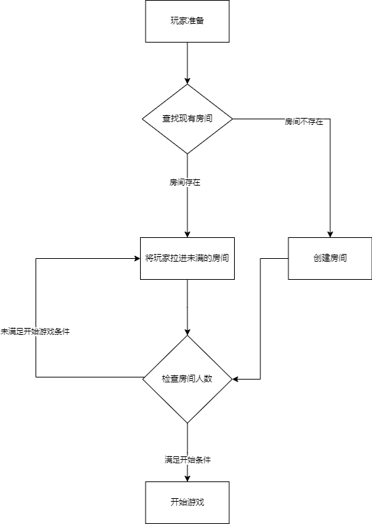
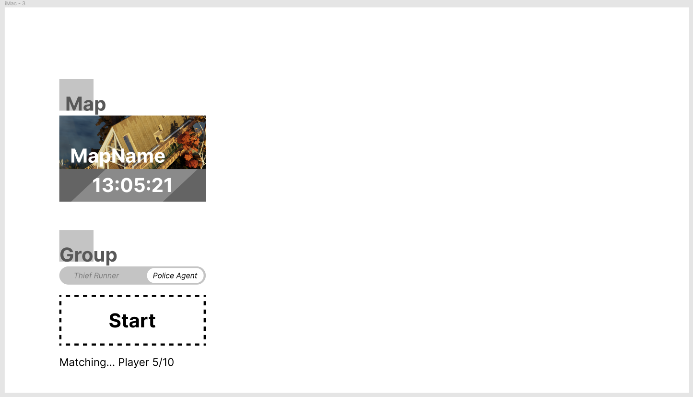
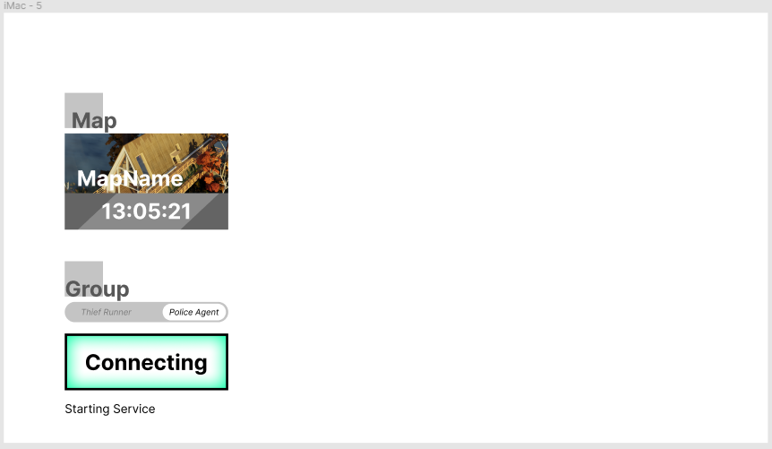

## 匹配模块

---

### 目的

- 给已准备玩家创建游戏对局
- 提供多人游戏开始的入口
- 删除已经结束游戏对局的房间

### 描述

在游戏开始前的准备，准备游戏房间。

---

### 功能流程

选择阵营 --> 准备完成 --> 开始匹配 --> 匹配成功 --> 选择角色--> 开始游戏

流程图：

--- 

### 功能

[游戏房间]()

#### 主要功能
- 显示匹配人数
- 阵营选择
- 创建游戏房间

#### 详细功能
- 查找已准备玩家
- 创建游戏对局房间
- 管理所有游戏对局房间状态
- 管理玩家对局状态
- 显示对局房间人数,检查房间人数
- 记录玩家准备时间
- 关卡轮换

### 界面

### 配置

#### 路径和表名
> level/Match Room

RoomInitID | RoomSize | PoliceSize | ThiefSize 
--- | --- | --- | --- 
01 | 5 | 2 | 3 