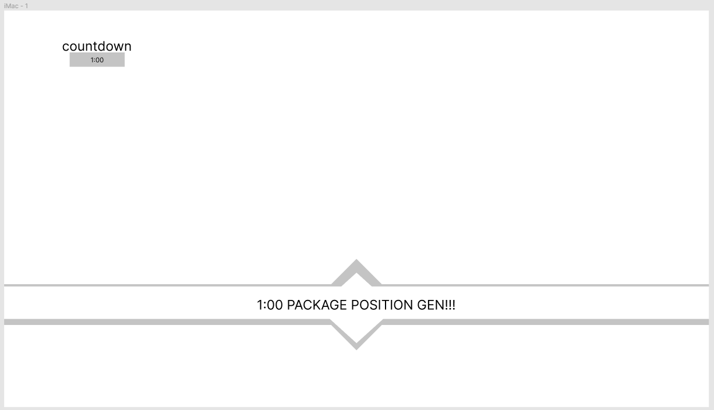
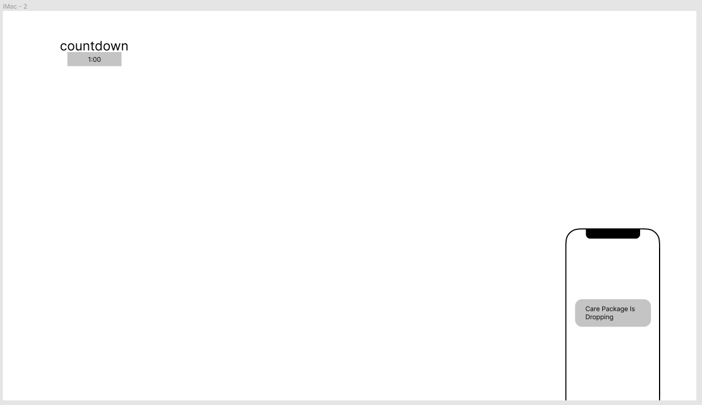

## 游戏流程控制（时间）

--- 

### 功能流程

- 游戏开始 --> 根据出生点生成对应阵营玩家 --> 根据时间广播包裹位置 -->包裹状态变化广播（1） --> 包裹到达指定位置游戏结束（2）--> 结束对局

### 流程图

### 目的
    
- 控制对局游戏流程
- 广播包裹状态变化

> ### 描述
> - （1）包裹被拿走时，委托人会以投影的方式出现，播报给其他的人说包裹已经被拿到了，其他人就不需要再过来拿包裹了，或者也可以抢夺，先到先得。警察通过监听委托人的信号，得知此消息。
> - （2）包裹到达警察方位置，判警察赢。包裹到达指定委托人位置，判运送小偷赢。

### 功能

倒计时功能
- 总时间15分钟
- 一分钟广播包裹位置
- 每隔一段时间增加小偷可打开的[资源箱]()
- 时间进行到15分钟游戏尚未结束时，警方加大警力游戏加时

### 界面

界面预览

- 倒计时
- 通知栏
- 手机右下角
- 通知阵营

### 配置

### 关卡模式
level/level mode:

ModeID | GlobalTime | StartTime | SourcesEventCD | OverTime
--- | --- | --- | --- | ---
01 | 15:00 | 1:00 | 2:30 | 15:00

> 字段|描述
> ---|---
> ModeID | 对局模式ID 
> GlobalTime | 总时间 
> StartTime | 开始播报时间
> SourcesEventCD | 空投时间
> OverTime | 加时时间节点
