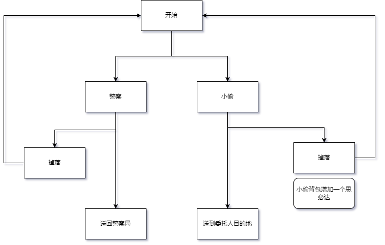

## 游戏流程控制（空间）

---

### 功能流程

- 游戏开始 --> 根据出生点生成对应阵营玩家 --> 根据时间广播包裹位置 -->- 包裹状态变化广播（1） --> 包裹到达指定位置游戏结束（2）--> 结束对局

### 流程图

### 目的

- 控制对局游戏流程

### 描述

- （1）包裹被拿走时，委托人会以投影的方式出现，播报给其他的人说包裹已被拿到了，其他人就不需要再过来拿包裹了，或者也可以抢夺，先到先得。警通过监听委托人的信号，得知此消息。
- （2）包裹到达警察方位置，判警察赢。包裹到达指定委托人位置，判运送小赢。

---

### 功能

- 根据设置好的出生点生成玩家出生位置
- 根据关卡策划的配置生成出口和入口
- 根据关卡策划配置的点生成送达点
- 根据关卡策划配置的点随机生成[资源点]()
- 根据关卡策划配置的包裹点列表生成[包裹]()

### 界面

- 显示包裹模糊位置（光柱）
- 显示补给箱精确位置（光柱）

### 配置

#### 关卡位置表

level/LevelPos:

LevelPOSID | ThiefSpawnPos[] | ThiefExitPos[]  | PackagePos[] | CarePackagePos[] | PoliceSpawnPos[] | ThiefSourcePos[]
--- | --- | --- | --- | --- | --- | --- 
01 | float3(0,0,0) | --- | --- | --- | --- | --- 

> 字段|描述
> ---|---
> LevelPOSID | 关卡ID
> ThiefSpawnPos | 小偷入口，出生点
> ThiefExitPos | 小偷出口，小偷包裹送达点
> PackagePos | 包裹位置
> CarePackagePos | 空投位置
> PoliceSpawnPos | 警察出生点，警察包裹送达点
> ThiefSourcePos | 小偷资源点 