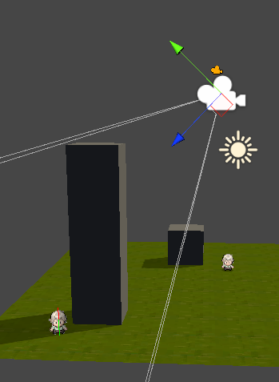
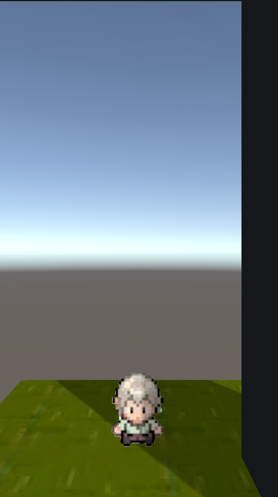
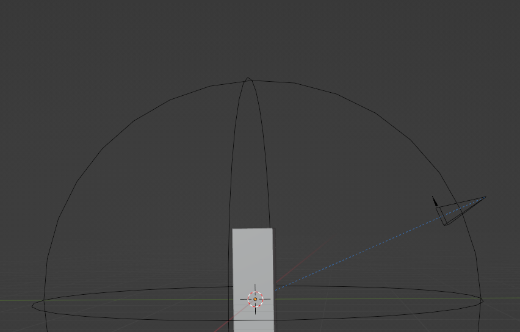

## 相机控制模块

### 概述
> 
玩家观察世界的必要物体。该游戏视角设计为可缩放的远距离第三人称自由视角。控制方式为鼠标中键按住左右移动为环绕玩家旋转，鼠标中键滚轮为缩放视角。

### 目的

控制玩家视角

### 流程

构建相机 --> 玩家输入 --> 程序控制相机

---

### 功能

#### 跟随模式
- dolly追踪模式
#### 环绕
- 按照球面坐标对跟踪对象进行环绕。
#### 跟随
- 设置跟踪对象。
- 跟踪对象位置并保持一定距离。
- 跟随缓动。
#### 推拉
- 推，靠近跟踪对象位置，同时缩小相机fov到范围值的最小值。
- 拉，远离跟踪对象位置，同时放大相机fov到范围值的最大值。
#### 注视LookAt
- 相机会一直盯着跟踪对象。
#### 事件行为
- 产生事件行为相机会靠近跟踪对象到3米左右，并且给跟踪对象特写，模糊除跟踪对象以外的事物。

---

### 图片演示

---

### 配置

#### 配置表

Camera/CameraSets

trackSetID |  speed | offset | damping | fovrangevec2 | fov
--- | --- | --- | --- | --- | --- 
--- | --- | --- | --- | --- | --- 

- 需要跟踪对象

> 描述|字段
> ---|---
> 配置ID|trackSetID
> 跟踪速度damp|speed
> 跟随offset距离|offset
> 缓动插值value|damping
> fov范围|fovrangevec2
> 默认fov|fov
